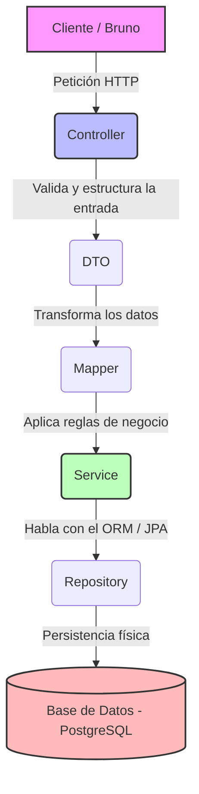

# 🚀 Flujo de Datos en nuestra Arquitectura (Spring Boot)

Para mantener nuestro código ordenado, escalable y seguro, la información sigue un camino obligatorio dividido en capas. A continuación se explica el ciclo de vida de una petición (desde que llega del cliente hasta que se guarda en la base de datos):

## 📝 ¿Cómo explicar cada capa con tus propias palabras?

### 1. Controller (El Recepcionista)
Es la puerta de entrada de la aplicación. Su única función es **escuchar las peticiones HTTP** (como los `GET`, `POST`, `DELETE` que probamos en Bruno) en una URL específica, capturar los datos que envía el cliente y delegar el trabajo pesado a la capa de servicios. No sabe cómo se guarda un dato ni conoce las reglas del negocio; solo atiende al cliente y le devuelve una respuesta.

### 2. DTO - Data Transfer Object (El Molde de Transporte)
Es un objeto plano de Java que sirve exclusivamente para **transportar datos entre el cliente y el servidor**. No es una tabla de la base de datos. Nos permite elegir qué campos queremos recibir o mostrar (por ejemplo, podemos ocultar contraseñas o campos internos) y validar que los datos vengan en el formato correcto antes de hacer cualquier otra cosa.

### 3. Mapper (El Traductor)
Es la capa encargada de **transformar un objeto en otro**. El controlador recibe un `DTO`, pero el servicio y la base de datos necesitan trabajar con una `Entidad` (la clase que representa la tabla real). El Mapper toma los datos del DTO y los "mapea" dentro de la Entidad (y viceversa a la hora de responder), evitando que tengamos que escribir código repetitivo a mano.

### 4. Service (El Cerebro / Reglas de Negocio)
Es la capa más importante de la aplicación porque **aquí reside la lógica del negocio**. El servicio recibe la entidad ya traducida por el Mapper y decide qué hacer con ella: realiza cálculos, verifica si un correo ya está duplicado, aplica descuentos o valida si hay stock disponible. Si todo está en orden, le pide al repositorio que guarde la información.

### 5. Repository (El Mensajero de la BD)
Es una interfaz que **se comunica directamente con la base de datos** utilizando Spring Data JPA. No escribimos consultas SQL manuales; el repositorio actúa como un intermediario que traduce las instrucciones de Java (como `.save()`, `.findById()` o `.delete()`) a comandos que el motor de la base de datos pueda entender.
